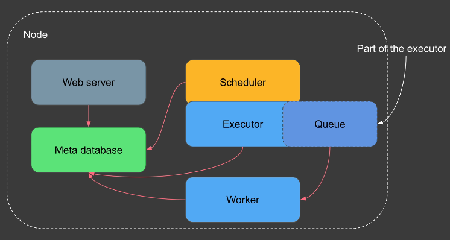
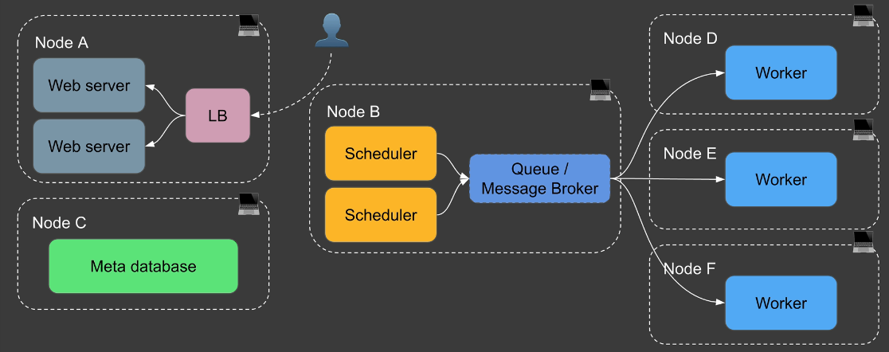

# Architecture

A node is a single computer or server. 

### Single-Node Architecture

* In a single-node architecture, all Airflow components (Scheduler, Workers, Database, and Web Interface) are hosted on a single machine.
* Worker is not a separate process. Instead, it is a local process that runs your tasks on the same machine.
* All the components communicate using the Metadatabase.

### Multi-Node Architecture

* Above diag is just an example of multi-node architecture, components can be in different nodes.
* A node is a single computer or server. Multi-node refers to running Airflow across multiple computers or servers.
* A single node can have multiple webservers, multiple schedlers.
* Each node have single worker node.
* **The 'Executor' is always the part of scheduler.**
