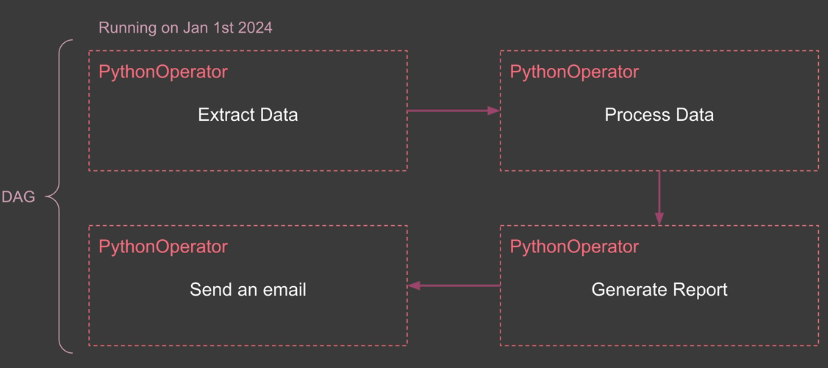

# Core Concept

### 1. DAG (Directed Acyclic Graph):

- It is a collection of tasks ordered in a way in which they should be executed.
- DAGs are directed (tasks have a defined order) and acyclic (no circular dependencies).
- It helps you to define the structure of your entire workflow, showing which tasks needs to happen before others.
- You can think of a Dag like a recipe, just as a recAirflow - Coding Pipelineipe lists all the steps to make a dish in the correct, A DAG in airflow lists all the tasks to complete your data workflow in the right sequence.
- Example
  

  Not a DAGs
  

### 2. Operator

- Operators define what gets done by a task in a DAG.
- If DAG is like recipe operators are like the individual instructions in that recipe. Just as break five eggs is a single step in a recipe.
- Some common operators-
  - **Python operator** to execute a Python script or function.
  - **Bash operator** to execute a bash script, or command the
  - **SQLExecuteQuery operator** to execute a SQL query to a database like MySQL or Postgres.
  - **FileSensor** to wait for a file.

### 3. **Task/Task Instance**

* A task is a specific instance of an operator. When an operator is assigned to a DAG, it becomes a task.
* A task represents actual unit of work that gets executed when your DAG runs.
* If break five eggs is an operator, break five eggs on July 1st at 2 p.m. will be a task instance.

### 4. Workflow

* A workflow is the entire process defined by your Dag, including all tasks and their dependencies.
* It represents your entire data pipeline showing how all the pieces fit together to achieve your goal.
* You can think of a workflow like the entire process of preparing a meal. It includes all the steps from gathering ingredients to cooking to serving and in airflow.

  Your workflow might be the daily sales report, which includes tasks for extracting sales data, processingit, generating a report, and emailing it to stakeholders.

**Note - A workflow is represented as a DAG (a Directed Acyclic Graph), and contains individual pieces of work called Tasks. **

