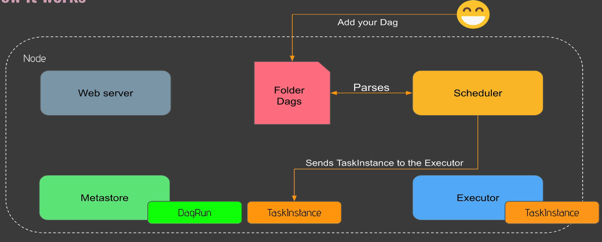

# Execution Overflow - How tasks are executed?

This is how Apache Airflow works:

1. When a DAG is placed in the DAGs folder, the Scheduler scans for new DAGs every 5 minutes.
2. When it finds a new Python file, it checks for any changes or errors. The Scheduler performs these checks on existing DAGs every 30 seconds.
3. The Scheduler runs the DAG, creating the DagRun Object and it marks the DagRun as queued in the Meta database. **DagRun is an instance of your DAG at any givem time.**
4. With the DagRun Object in a "running" status, it takes the first task to be executed, turning it into a TaskInstance Object. This object has two statuses: "none" or "scheduled."
5. The Scheduler then sends the TaskInstance Object to the Executor, where it enters the Executor Queue and gets a "Queued" status.
6. The Executor creates a subprocess to run the task, which can result in success or failure.**The executor does not execute your tasks, worker executes your tasks.**
7. Finally, the Web Server updates its UI with the Metastore data about the execution statuses.
