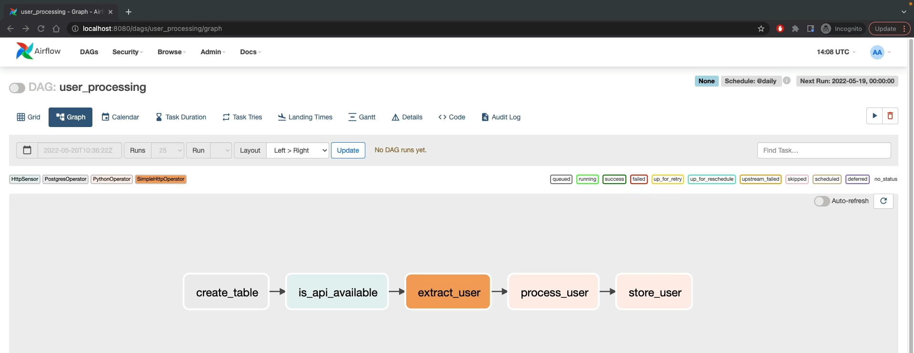
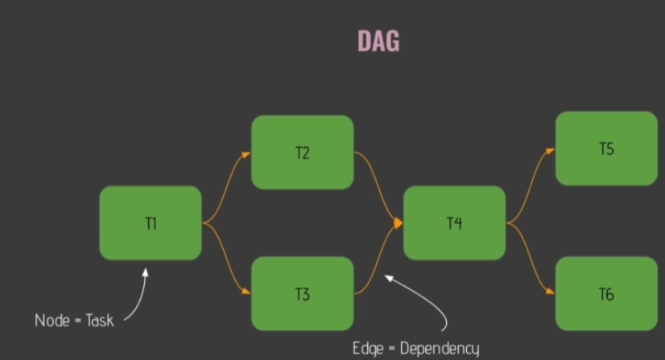
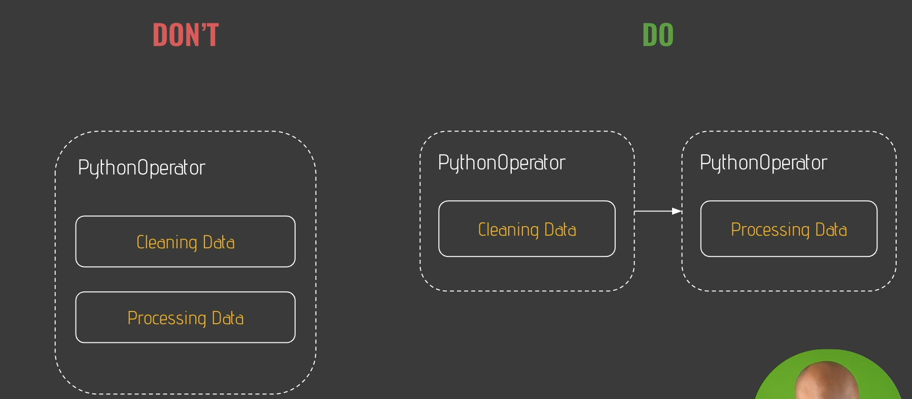
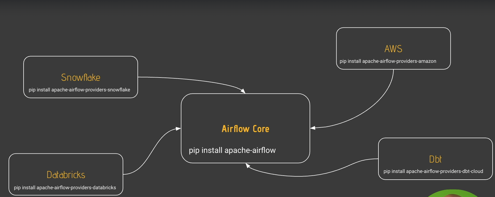

# The Project

## Data Pipeline

A data pipeline in Apache Airflow is a series of tasks that execute in a specific order to process and move data from one system to another.

The order of execution and the dependencies between tasks are defined using a Directed Acyclic Graph (DAG).

## Project Structure

The project will be based on the creation of 1 DAG with 5 tasks.

1. **create_table** : This task will create a table in a PostgreSQL relational database (included in the Airflow container that I'll be using).
2. **is_api_available** : This task will check if a given API is available for obtaining future data.
3. **extract_user** : This task will obtain user information from the previously checked API.
4. **process_user** : This task will perform transformations on the users as necessary before they are stored (previously was the E, now it's the T of ETL).
5. **store_user** : Finally, this task will store the data in the database (the L of ETL, concluding the process).

   

## What is a DAG?

It is a directed acyclic graph, as can be seen in the model below, where the nodes are tasks and the directed edges correspond to their dependencies.



## Initial Skeleton of a DAG

```python
from airflow import DAG

from datetime import datetime

with DAG('user_processing', start_date=datetime(2022, 1, 1),
         schedule_interval='@daily', catchup=False) as dag:
    None
```

The code above is an example of the basic skeleton of a DAG. Let's review each item and its functions:

1. **from airflow import DAG** : This line imports the DAG class from the airflow module. The DAG class is used to define a Directed Acyclic Graph (DAG), which is a collection of tasks with defined dependencies and relationships.
2. **from datetime import datetime** :This line imports the datetime class from the datetime module. The datetime class is used to work with dates and times in Python.
3. **with DAG('user_processing'....** : Defines the unique ID to identify the DAG. The name of the DAG is set to 'user_processing'. This is a unique identifier for the DAG.

   The "with" statement in Python is a replacement for commonly used try/finally error-handling statements. The with statement automatically closes the file after you’ve completed writing it.
4. **start_date=datetime(2022, 1, 1)...** : The start_date parameter defines the starting point for the DAG's scheduling. In this case, it is set to January 1, 2022. This means that the DAG will start running from this date.
5. **schedule_interval='@daily'...** : The schedule_interval parameter defines how often the DAG should run. Here, it is set to @daily, which is a **cron expression** shortcut for running the DAG once a day at midnight. Cron of this will be (**0** **0** * * *).
6. **catchup=False...** : If this option is left as true, all subsequent executions that should have run will be executed by Airflow. Leaving it as False provides greater control, which can be a good option for better managing DAG executions.
7. **None** : Since we haven't created anything yet, we'll just leave it empty.

## What is an Operator?

Operators are the tasks within the DAG.

**Important Tip:** Never pass two different tasks within the same Operator. For example, if you have a PythonOperator to clean the data and another one to process the data, never pass both tasks as a single Operator.

Why? Because if there's an error, both processes will need to start over!

For better practices and organization of projects, create one PythonOperator to clean the data and another one to process the data.



### Types of Operators

1. **Action Operators** : ***Execute*** an action. Example is the BashOperator, which executes a bash command.
2. **Transfer Operators** : ***Transfer*** data. Example is the S3ToGCSOperator, which transfers data from Amazon S3 to Google Cloud Storage.
3. **Sensors** : ***Wait for*** a condition to occur. Example is FileSensor, which waits for a file to appear in a specified location.

## Providers

The installation of Airflow is modular. When you install it, you have the core module i.e. "Airflow Core" which provides basics funcationalities like PyhtonOperator etc. .  If you want to interact with AWS or Dbt, you have to install the providers, which allow Airflow to interact with these other tools and environments. This is one of the features that makes Airflow so powerful and scalable.



## What is a Sensor?

Sensors wait for an event (or condition) before taking action. For example, imagine a person waiting at a bus stop for some time. They will remain there until they spot the bus (the event) and then they will stand up to wait for the vehicle to stop so they can finally board it.

### Two important concepts in Sensors

There are two concepts involving connection validation time. The first one is the ***poke_interval*** and the second one is  ***timeout*** .

* **poke_interval** : This parameter sets the interval between sensor condition checks. It specifies how often the sensor will check if the desired condition has been met. By default it is set to 60 sec. For example, if you set a ***poke_interval*** of 5 minutes, the sensor will check the condition every 5 minutes to see if it has been met.
* **timeout** : The timeout parameter sets how long the sensor will wait until the condition is met before considering it a failure. If the condition is not met within this period of time, the sensor will fail, and the workflow can handle the failure according to the specified settings. By default it is set to 7 days. 

```python
from airflow import DAG
from airflow.providers.postgres.operators.postgres import PostgresOperator
from airflow.providers.http.sensors.http import HttpSensor

from datetime import datetime

with DAG('user_processing', start_date=datetime(2022, 1, 1),
         schedule_interval='@daily', catchup=False) as dag:
  
    create_table = PostgresOperator(
        task_id='create_table',
        postgres_conn_id='postgres',
        sql='''
              CREATE TABLE IF NOT EXISTS users(
                    firstname TEXT NOT NULL,
                    lastname  TEXT NOT NULL,
                    country   TEXT NOT NULL,
                    username  TEXT NOT NULL,
                    password  TEXT NOT NULL,
                    email     TEXT NOT NULL
              );
          '''
    )

    is_api_available = HttpSensor(
        task_id='is_api_available',
        http_conn_id='user_api',
        endpoint='api/'
    )
```

1. **from airflow.providers.postgres.operators.postgres import PostgresOperator** : Imports the correct provider for PostgreSQL. Note: I have already configured the connection in the Airflow webserver (there is a PostgreSQL installed along with the Docker Compose image used).
2. **create_table = PostgresOperator** : The new task will make use of the appropriate operator to interact with PostgreSQL.
3. **postgres_conn_id='postgres'** : Connection identifier (already configured, as mentioned before).
4. **sql=...** : The content of the SQL query.
5. **from airflow.providers.http.sensors.http import HttpSensor** : Provider for the HTTP sensor.
6. **http_conn_id='user_api'** : Specifies the HTTP connection to be used by the sensor to communicate with the API. This connection must be previously configured in Airflow using the Connections menu of the Airflow web interface.
7. **endpoint='api/'** : Indicates the API endpoint that the sensor will access to check if it is available. In this example, the sensor will access the api/ endpoint of the API.

## What is a Hook?

Hooks are interfaces to external systems. They are used to connect to and interact with databases, APIs, and other services. Hooks provide methods to simplify the process of querying databases, making HTTP requests, etc.

The PostgresOperator would be responsible for connecting to the database; however, between the Operator and the database, the PostgresHook comes into play. It is necessary to abstract all the complexity involved in interacting with the PostgreSQL database.

In essence, it is necessary to use Hooks as intermediaries between the Operators and the entity being connected.

```python
from airflow import DAG
from airflow.providers.postgres.operators.postgres import PostgresOperator
from airflow.providers.http.sensors.http import HttpSensor
from airflow.providers.http.operators.http import SimpleHttpOperator
from airflow.operators.python_operator import PythonOperator
from airflow.providers.postgres.hooks.postgres import PostgresHook

def _store_user():
    hook = PostgresHook(postgres_conn_id='postgres')
    hook.copy_expert(
        sql="COPY users FROM stdin WITH DELIMITER as ','",
        filename='/tmp/processed_user.csv'
    )

with DAG('user_processing', start_date=datetime(2022, 1, 1),
         schedule_interval='@daily', catchup=False) as dag:
...

    store_user = PythonOperator(
        task_id='store_user',
        python_callable=_store_user
    )


create_table >> is_api_available >> extract_user >> process_user >> store_user
```

### Code Explanation

PostgresHook: A hook instance is created to connect to the PostgreSQL database using the connection ID postgres.

copy_expert Method: This method is used to execute the SQL COPY command, which copies data from a CSV file (/tmp/processed_user.csv) into the users table in the PostgreSQL database.


### PostgresHook

The PostgresHook is a specific type of hook in Airflow designed to interact with PostgreSQL databases. It provides methods for connecting to a PostgreSQL database and executing SQL queries.


### PostgreSQL vs SQL Server

SQL Server has a row-based table structure that allows you to connect related data elements from different tables without having to store data multiple times in a database. 

A relational database management system (RDBMS) is based on the relational model of data. e.g. SQL Server

An object-relational database management is based on the relational model with additional support for object-oriented concepts, such as classes, objects, and inheritance. For example, an object-relational database management system can handle new data types like video, audio, and image files that RDBMSs are not equipped to handle. e.g. PostgreSQL


### You want to make a SQL Request on Postgres Database using PostgresOpeator.

SQL Request: Refers to executing SQL commands or SQL Query.

Postgres Request: Using SQL commands to interact with a PostgreSQL database.

SQL and Postgres Relationship: PostgreSQL is a database system that uses SQL as its query language.

Airflow PostgresOperator: A tool in Airflow to execute SQL commands on a PostgreSQL database.


### What if we didn't used Hook?

```python
import psycopg2

def _store_user():
    # Define the connection parameters
    conn_params = {
        'dbname': 'your_db_name',
        'user': 'your_db_user',
        'password': 'your_db_password',
        'host': 'your_db_host',
        'port': 'your_db_port'
    }
  
    # Connect to the PostgreSQL database
    conn = psycopg2.connect(**conn_params)
  
    try:
        # Create a cursor object
        cursor = conn.cursor()
    
        # Open the CSV file
        with open('/tmp/processed_user.csv', 'r') as f:
            # Use the copy_expert method to load data from the CSV file into the users table
            cursor.copy_expert(
                sql="COPY users FROM stdin WITH DELIMITER as ','",
                file=f
            )
    
        # Commit the transaction
        conn.commit()
  
    except Exception as e:
        # Rollback the transaction in case of an error
        conn.rollback()
        raise e
  
    finally:
        # Close the cursor and the connection
        cursor.close()
        conn.close()
```

The ** operator in psycopg2.connect(**conn_params) is a shorthand for passing multiple keyword arguments to a function, making the code cleaner and more flexible.


### Using Hook vs Without using Hook

1. **Connection Management:**

Without Hook: Manual connection management is needed (psycopg2.connect), including handling connection parameters, creating a cursor, and closing both.

With Hook: The PostgresHook handles connection management automatically. You only need to specify the connection ID (postgres_conn_id).

File Operations:

Without Hook: Manually open the CSV file and pass it to the copy_expert method of the cursor.

With Hook: The hook's copy_expert method takes care of opening the file and executing the COPY command.

Transaction Management:


Without Hook: Manually commit the transaction, and handle rollbacks in case of errors using try-except-finally blocks.

With Hook: The PostgresHook abstracts away transaction management, making the code cleaner and reducing the likelihood of errors.


## The Final Result of the DAG

Above, we can see the graph showing the relationship between the elements of the DAG. In essence, it is a model that demonstrates the ability to create a table in a PostgreSQL database, check if an API is available, retrieve data from that API, and, using Pandas resources to handle JSON, structure it in a more aesthetic way and save it to the database, utilizing the features we covered with the Hook (read the previous topic above).

## Executing the DAG with Success!

We can see in the image below that the DAG was executed successfully.

In the image below, we can see that the data transfer from the user extraction API was successful and that the CSV document was saved properly in the container.

Finally, in the image below, we can see the container's terminal containing PostgreSQL and with the table we had created in the DAG, now populated with the user obtained from the public API that generates random users.


## Scheduling DAG Execution

* **start_date** : the timestamp from which the scheduler will attempt to backfill
* **schedule_interval** : how often a DAG runs
* **end_date** : the timestamp from which a DAG ends

```python
with DAG('my_example_dag', start_date=datetime(2022, 1, 1),
         schedule_interval='@daily') as dag:
```

The *schedule_interval* accepts CRON-like expressions, but there are some predefined forms (like the case of @daily). However, for finer adjustments, it is recommended to understand how to work with CRON.

Note: A DAG is triggered AFTER the start_date/last_run + the schedule_interval. 


### A Practical Example of DAG Execution


Let's assume we have a DAG with a *start_date* at 10:00 AM and a *schedule_interval* every 10 minutes.

At 10:00 AM, nothing happens, although it's the *start_date* marker. After waiting for 10 minutes, Airflow will actually execute the DAG at 10:10 AM.

After 10 minutes, the DAG will be executed again, now at 10:20 AM.


### The Catchup Mechanism


In summary, if you create a DAG and set the *start_date* to, for example, '2022-01-03', but you created it on '2022-01-07' and you're going to run it for the present day, if the *catchup* is not configured as  *false* , then the DAG will perform a backfill execution for each previous day from the *start_date* and not from the present day ('2022-01-07'). To prevent this from happening, it will be necessary to configure the *catchup* as  *false* .


### Let's assume a DAG start_date to the 28/10/2021:10:00:00 PM UTC and the DAG is turned on at 10:30:00 PM UTC with a schedule_interval of */10 * * * * (After every 10 minutes). How many DagRuns are going to be executed?

The first one is executed at 10:10 for the execution_date 10:00, then 10:20 for the execution_date 10:20. DAG Run 3 is not yet executed since a DAG Run runs once the schedule_interval (10 minutes here) is passed.

Therefore, only 2 DAGs will run!
