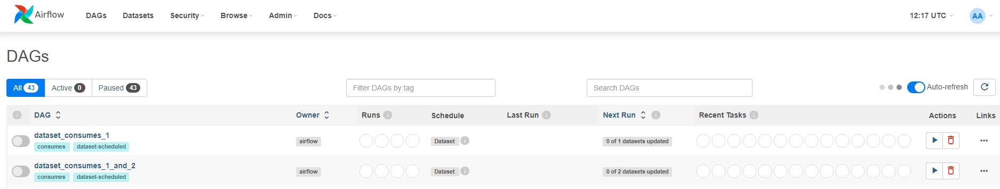
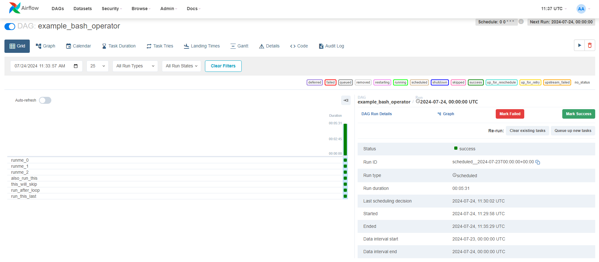
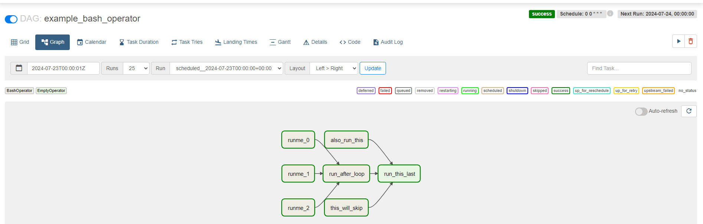
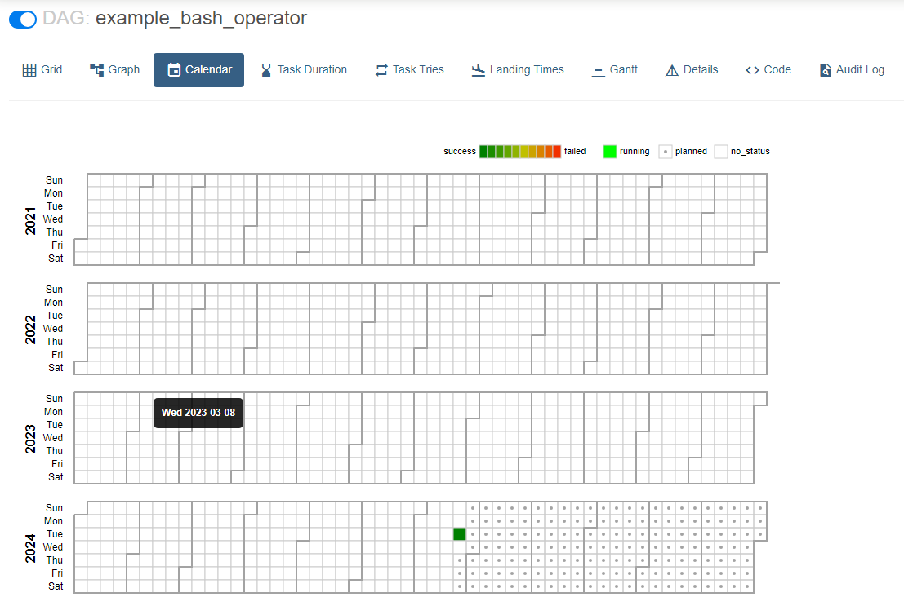
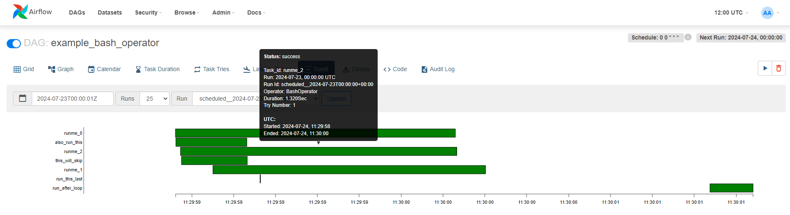

# Views

### DAG Views

* The DAG view displays all DAGs that have been recognized and loaded successfully in Airflow. Multiple example DAGs are often loaded automatically.
* To activate a DAG, simply select the button on the left corner next to the DAG name.
* OWNER field provides information about the owner of the DAG.
* RUN provides the iInformation related to statuses - Queued, Success, Running and Failed.
* SCHEDULE points to schedules (e.g., daily, monthly, etc.), and there is support for using CRON expressions.
* LAST RUN shows when the DAG last ran; NEXT RUN shows when the next execution is scheduled.
* RECENT TASK acts as a small history of the most recent executions of the DAG in question.
* RUN button that allows us to manually trigger the DAG
* DELETE option (it does not delete the DAG file, but only deletes the metadata in the interface), and the links to other useful views.

### Grid View

* A useful visualization for quickly seeing the status of task histories.
* There is a diagram with some bars and a right-hand side view with more detailed information about the execution.
* best to get the history of the states of your DAG Runs and Tasks

### Graph View

* displays the structure of the DAG.
* A view with some rectangles, which represent tasks, also shows the execution order, and through the outlines of the geometric shapes, we can use colors to understand the execution statuses.
* Best for checking the dependency.

### Landing Times View

* After some time of execution, as a history is generated, this graph becomes useful for monitoring the execution time, which helps to consider future optimizations.
* best view to monitoring the time it takes for your tasks to complete over many DAG Runs

### Calendar View

A calendar view with colors marking the proportion of successes and failures. This helps to have a clear view of how the DAG has been behaving over time, and through some points on the calendar, observe the days marked for future executions.

### Gantt View

A Gantt chart that helps observe bottlenecks. The more filled the rectangles are, the more attention we should pay, as this shows longer execution times, meaning some bottleneck may be occurring. It is also possible to see, by the interleaving of the rectangles, parallel executions.

### Code View

Allows viewing the code of the DAG and making necessary modifications if desired.
