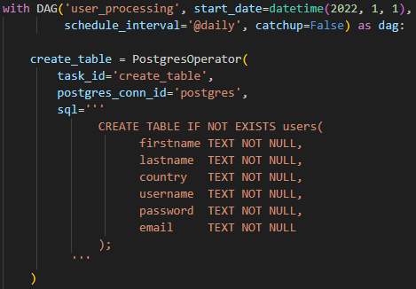
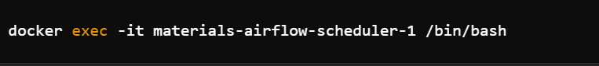
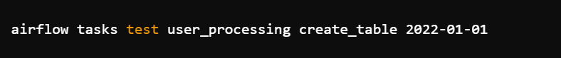
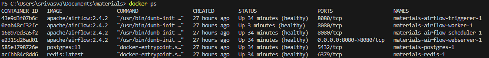

# Creating Table



1. with DAG('user_processing', start_date=datetime(2022, 1, 1), schedule_interval='@daily', catchup=False) as dag:

* with DAG(...) as dag:: This line starts a block of code that defines a Directed Acyclic Graph (DAG) named user_processing. A DAG in Apache Airflow is a collection of all the tasks you want to run, organized in a way that reflects their relationships and dependencies.
* 'user_processing': The name of the DAG.
* start_date=datetime(2022, 1, 1): The date and time when the DAG will start running. In this case, it starts on January 1, 2022.
* schedule_interval='@daily': This sets the DAG to run once a day. The @daily interval means the DAG will be triggered every day at midnight.
* catchup=False: This means the DAG will not try to "catch up" on any missed runs between the start_date and the current date. It will only run from the current date onwards.

2. create_table = PostgresOperator(...)

* create_table: This is the variable name for the task. It uses the PostgresOperator to execute SQL commands on a PostgreSQL database.
* PostgresOperator: This operator is used to interact with PostgreSQL databases within an Airflow DAG.
* task_id='create_table': This sets the task's unique identifier to create_table. Every task in an Airflow DAG needs a unique task_id.
* postgres_conn_id='postgres': This specifies the connection ID for the PostgreSQL database. Airflow uses this connection ID to find the database credentials and connection details.
* sql='''...''': This is the SQL command that the task will execute. The command is wrapped in triple quotes to allow for a multi-line string.

# Connection

Connection in Apache Airflow is a section in the Airflow web interface where you can manage connections to various external systems and databases. These connections are stored centrally and can be reused across multiple DAGs and tasks, making it easier to manage and secure credentials.

## Why Do We Need a Connection for Creating a PostgreSQL Table?

* To interact with a PostgreSQL database (or any external system), Airflow needs to know how to connect to it.
* The connection includes credentials (username and password) required to authenticate with the PostgreSQL database.
* It specifies the location of the database (hostname and port).
* It ensures that only authorized Airflow tasks can access the database using the provided credentials.
* Defining a connection once in the Airflow admin interface allows it to be reused across multiple tasks and DAGs without hardcoding sensitive information in the code.

## Checking a task using a Docker container

### Using the Airflow CLI

1. Use the docker exec command to open a bash shell in the running Airflow scheduler container.

   

* docker exec: This command runs a new command in a running container.
* -it: This option allows you to open an interactive terminal.
* materials-airflow-scheduler-1: The name or ID of your Airflow scheduler container.
* /bin/bash: The command to run inside the container, which opens a bash shell.

2. Once inside the container, use the airflow tasks test command to manually trigger and test the task.



* airflow tasks test: This is the command to test an Airflow task.
* user_processing: The name of the DAG containing the task.
* create_table: The task ID you want to test.
* 2022-01-01: The execution date for the task.

### Using the Airflow Web UI

1. Access the Web UI: Open your browser and navigate to the Airflow Web UI (e.g., http://localhost:8080 if running locally).
2. Find Your DAG: Locate the DAG you want to test on the main page.
3. Trigger a Task:
   * Click on the DAG to see its details.
   * Find the task you want to test in the DAG's graph view or task list.
   * Click on the task to bring up more options.
   * Choose "Trigger" or ""Run”to execute the task manually.

### Testing Directly in Your Code

You can also test by invoking the task's function directly.

## Common Docker containers used in an Apache Airflow setup



**Web Server:**

* Purpose: Provides the user interface to interact with Airflow, allowing you to view DAGs, manage tasks, and monitor the system.
* Container Name: Usually something like airflow-webserver.

**Scheduler:**

* Purpose: Handles the scheduling of tasks, monitoring DAGs and task dependencies, and queuing tasks for execution.
* Container Name: Usually something like airflow-scheduler.

**Worker:**

* Purpose: Executes the tasks assigned by the scheduler. You can have multiple worker containers to parallelize task execution.
* Container Name: Often named like airflow-worker.

**Database:**

* Purpose: Stores the state and metadata of DAGs, tasks, users, and other Airflow components. Common databases include PostgreSQL or MySQL.
* Container Name: Named according to the database used, like airflow-postgres.

****Triggerer**:**

* Purpose : Dedicated to handling deferred tasks, which are tasks that are scheduled to run based on external triggers.
* Container Name : Often named like airflow-triggerer.

# Is the API available?

```python
is_api_available = HttpSensor(
        task_id='is_api_available',
        queue='high_cpu',
        http_conn_id='user_api',
        endpoint='api/'
    )
```

## HttpSensor

An HttpSensor is a type of sensor that waits for an HTTP response at a specified endpoint before allowing a workflow to proceed. We need to import HttpSensor from airflow.providers.http.sensors.http. 

How It Works

* Set Up: You give it a URL to check and what kind of response it should look for.
* Periodically Checks: It sends requests to the URL at regular intervals (like every few minutes).
* Condition Met: Once it sees the response you told it to look for, it stops checking and allows the workflow to continue.
* Timeout: If it doesn't find the expected response within a certain time, it will stop trying and mark the task as failed.

HttpSensor:

* task_id: A unique ID for the sensor task.
* http_conn_id: A connection ID for the HTTP service (defined in Airflow connections).
* endpoint: The specific part of the URL to check (e.g., api/status).
* request_params: Any parameters to include in the request (empty in this case).
* headers: Any headers to include in the request (empty in this case).
* response_check: A lambda function to check if the response meets the condition (status key in JSON response should be "success").
* poke_interval: How often to check the URL (every 30 seconds in this case).
* timeout: How long to keep checking before giving up (10 minutes in this case).
